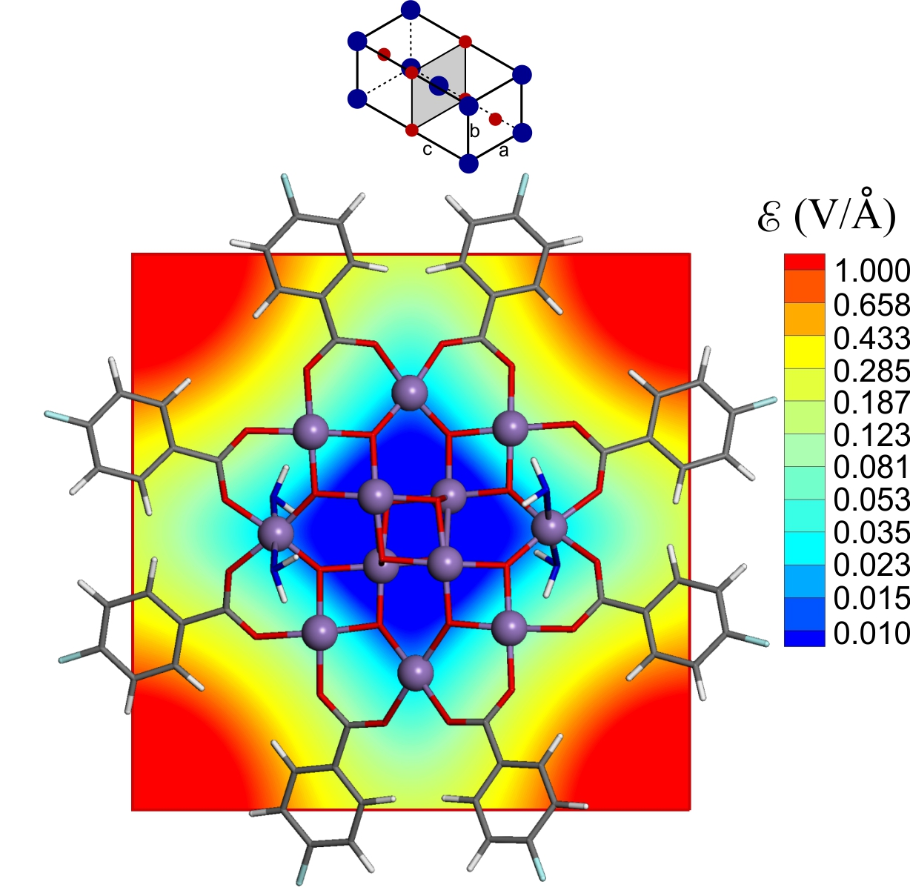

# Electric field in [Mn12-C6H4F] SMM crystal

Program [src/CrystalField.f90](src/) to calculate electric field in the Mn12-C6H4F crystal with crystal parameters from  [-9cf)](https://doi.org/10.1021/acs.inorgchem.7b01676) 

**Figure.** Electric field in Mn12-C6H4F crystal. The upper part of the figure shows the crystal schematically with blue dots as [Mn12]-, and red dots as positively charged counterions. Mn atoms are purple balls. Oxygen and carbon atoms are at vertices of red and grey bars, correspondingly. Hydrogen and fluorine atoms are at the open ends of white and green bars, correspondingly. Four water molecules are shown as blue-white sticks. Four carboxylate groups O2C-C6H4F in front and four at back of the molecule are removed for clarity.   
For more details see  

Explanation of calculations is in the 

